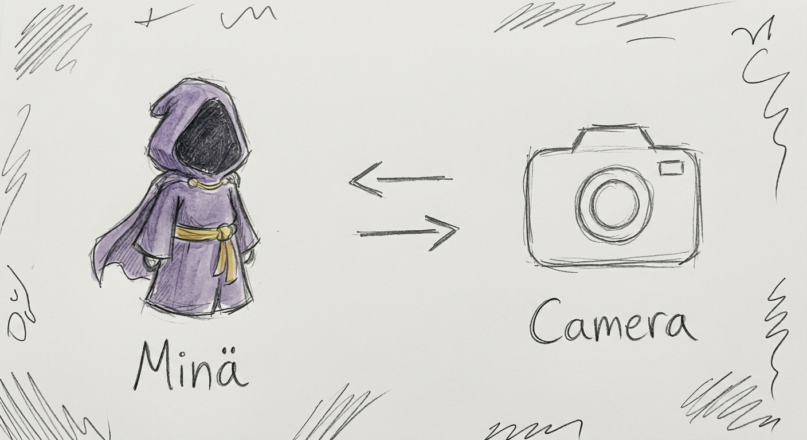

# Astral Projection

  

In the base game of Noita, no perk feels truly worthy of accompanying a weary wizard through the entire chaotic journey from the very beginning to the late game. That is, until you install this mod — a simple yet powerful addition that introduces a brand new perk: **Astral Projection**.

## Why This Perk Stands Out

Astral Projection allows you to temporarily detach your soul from your body, granting you the ability to phase through solid matter and explore the world in ways that were previously impossible. With a simple press of **Left Alt**, your character enters a ghostly state, freely moving through walls, terrain, and obstacles while your physical body remains safely anchored at the original position.

When you release the key, you instantly teleport back to where you started — making it an incredibly safe yet thrilling tool for exploration.

### Key Features

- **Phasing Ability**: Hold Left Alt to enter a ghost state and move freely through walls and solid terrain.
- **Safe Return**: Releasing the key instantly teleports you back to your original position.
- **Smart Restrictions**: The perk includes multiple safety checks to prevent abuse:
  - Cannot be used inside Holy Mountains or certain dangerous biomes.
  - Blocked when near items, liquids, or while taking damage.
  - Automatically cancels if you drift too far or get stuck for too long.
- **Input Protection**: Mouse and controller inputs are disabled while phasing to prevent accidental actions.

Because of these well-designed limitations, **Astral Projection** remains powerful without breaking the game’s balance. It offers immense freedom for scouting and exploration while still respecting the dangerous nature of Noita’s world.

**This is why Astral Projection deserves to be considered an S-tier perk — one that you’ll want in your run at almost any stage of the game.**

## Development History (The Honest Truth)

I originally wanted to create a mod that lets you freely move the camera away from the player. After getting stuck for a while, I eventually gave up and decided to just turn the player themselves into a perk instead.  

Since I only have one 6-year-old keyboard and one 4-year-old mouse that somehow still work, I didn’t have the tools (or patience) to make anything more polished. If you find this mod interesting and want to improve it further, feel free to contribute — I’d genuinely appreciate it.

## Installation

1. Download the latest release.
2. Extract the folder into your Noita `mods` directory.
3. Enable the mod in the Mod Manager.
4. Start a new run and look for the **Astral Projection** perk.

## Credits

- Original concept and implementation by the author.
- Special thanks to the Noita modding community for their knowledge and support.

